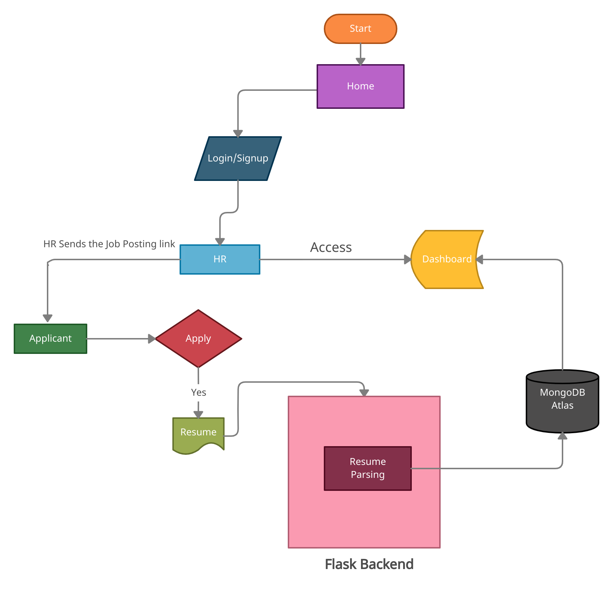

# iProfiler

- A profile filtering tool that helps selecting out relevant prospects from a pool of generic applicants.

<p align="center">
  
</p>

- A product to ease out the life of HR Representatives and streamline remote recruitment process.

> Working prototype [*here*](https://bit.ly/2R5WF6T)

>  Demo of the Product [*here*](https://drive.google.com/file/d/1ijbb6Gd8YhRvifMsdgbIdopXVGKcNi16/view?usp=sharing)

## :ledger: Index

- [Index](#index)
- [About](#about)
- [File Structure](#file-structure)
- [Flow Chart](#flow-chart)
- [Info Gallery](#gallery)
- [Future Work](#future-work)
- [Resources](#resources)
- [Present Contributors](#contributors)

## :beginner: About

> Traditional way of Recruiting:

- Evaluating each incoming application is tedious and counterproductive.
- Recruiting the best candidates  for the requirement of a job  role can be cumbersome.
- Difficulty in keeping track of  promising applications which  weren’t processed earlier.
<br>

> Why iProfiler?

<p>To filter based candidates out of the pool of them, iProfiler comes to the rescue. </p>

- We automate the manual resume screening by leveraging the *AI Resume Parsing* feature of the product.
- Multi-Filter provided by the application would help HR to segregate hundreds of generic profiles of users and only relevant will be saved for the later stage.
- Cloud-based storage allows 24/7  access to the applicants' data and  keeps it intact for future use.

Thus, iProfiler is a handy tool for all HR representatives.

> Note: Our target customers are the HR representatives of a firm.

## :open_file_folder: File Structure

- File structure with the basic details about files and directories.

```bash
- __iprofiler__
├── .venv
├── flask-server
│   ├── static
|   |   ├── react
|   |   |   ├── css
|   |   |   ├── js
|   |   |   ├── media
│   ├── templates
|   |   ├── index.html
│   ├── app.py
├── react-app
│   ├── build
│   ├── config
│   ├── public
|   |   ├── index.html
│   ├── scripts
│   ├── src
|   |   ├── assets
|   |   ├── components
|   |   ├── pages
|   |   ├── App.tsx
|   |   ├── index.tsx
│   ├── package.json
│   ├── tsconfig.json
├── .gitlab-ci.yml
├── requirements.txt
├── .gitlab-ci.yml
└── README.md
``` 
## Flow Chart

<p align="center">
   <br>
</p>

## :camera: Info Gallery

<p align="center">
   <br>
  Pyzbar Decoding of our vedio frame <br><hr/><br>
</p>
<p align="center">
   <br>
  Final Working of our Model <br><hr/><br>
</p>
<p align="center">
   <br>
  Final Output <br><hr/><br>
</p>
